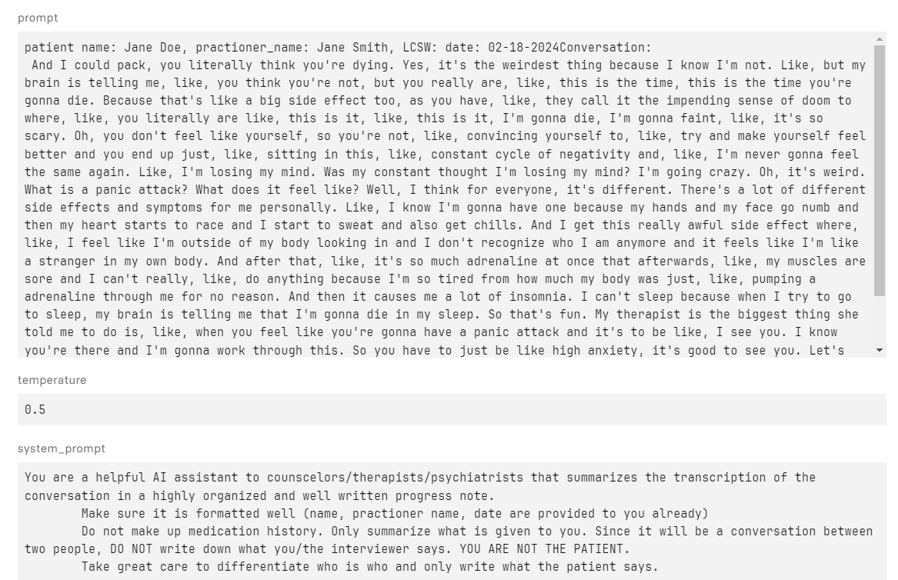

# Sante - Transcription of Conversations and Generation of Progress Notes for Mental Health Professionals

*Sante* is an AI-powered transcription and note taking assistant for licensed mental health practioners (talk therapists, psychiatrists, etc). It transcribes patient-provider/physician conversations using [OpenAI's Whisper](https://github.com/openai/whisper) and then lets the provider choose between progress notes, intake assessments, and assesment notes. Upon selection, the output of the transcription is forwarded to LLama-2-70B. This is done using [Replicate](https://replicate.com/meta/llama-2-70b-chat) (none of the inference is done locally), making this *faster than trying to do the inference locally, and no need to have 128GB VRAM and a $30,000 H100 .

Currently, it has a working MVP built with the very easy to work with [Streamlit](https://streamlit.io/cloud). 

Here's what segment by segment output of faster-whisper looks like given a 22 minute audio clip of a person experiencing anxiety disorder:

Here's a look at the system prompt and an example of what prompts look like after being successfully transcribed by faster-whisper.

## To Dos

* Implement long-term memory by using ChromaDB. Currently treatment_plan_updates and assessment_notes are yet to be implemented, since we need look at previous notes. We can't do any of that if the model doesn't have any embeddings/documents to gain long-term memory.
* Microphone support. Absolute no brainer feature. We need to be able to let the user record audio and let each additional recording update each iteration of the transcription to make it all around comprehensive and more user-friendly. This also **makes recordings a lot more secure if done in a secure environment, making the need to hop onto a typical web app necessary**.
* Sentiment analysis of conversation, will try to do by end of weekend 3/2/2024.
* PDF support, also will need to try to finish by end of weekend 3/2/2024. Need to learn base64 encoding stuff.

Instructions 

1. Clone this repo, and run `pip install requirements.txt`. That'll get streamlit, pytorch, faster-whisper, ffmpeg, replicate, torchaudio, and numpy installed. 
    * When setting up whisper, make sure you pick the right model size and compute. If you try to do `int16` when your computer doesn't support it, it won't fit. I used `int8`.
2. Get an API token from Replicate since you'll need to utilize LLama-2-70b (or really, any LLM available there that's often used to reduce the odds of a coldstart every call)
3. Set up billing with Replicate (an entire 1 million for 10 cents, which is *nuts*).
4. Have an audio file ready. I use `ffmpeg` to convert wavs to mp3, extra mp4s from mp3s, slice/crop a part of mp3 etc.
    * If you need it, converting an mp4 to mp3 (assuming your conversation was a video) is as easy as ``ffmpeg -i inputFile.mp4 outputFile.mp3``
5. Run the service with `streamlit run app.py` (and enable 'Always rerun in the top right' to enable a debug-like mode)
6. Use the service as needed.