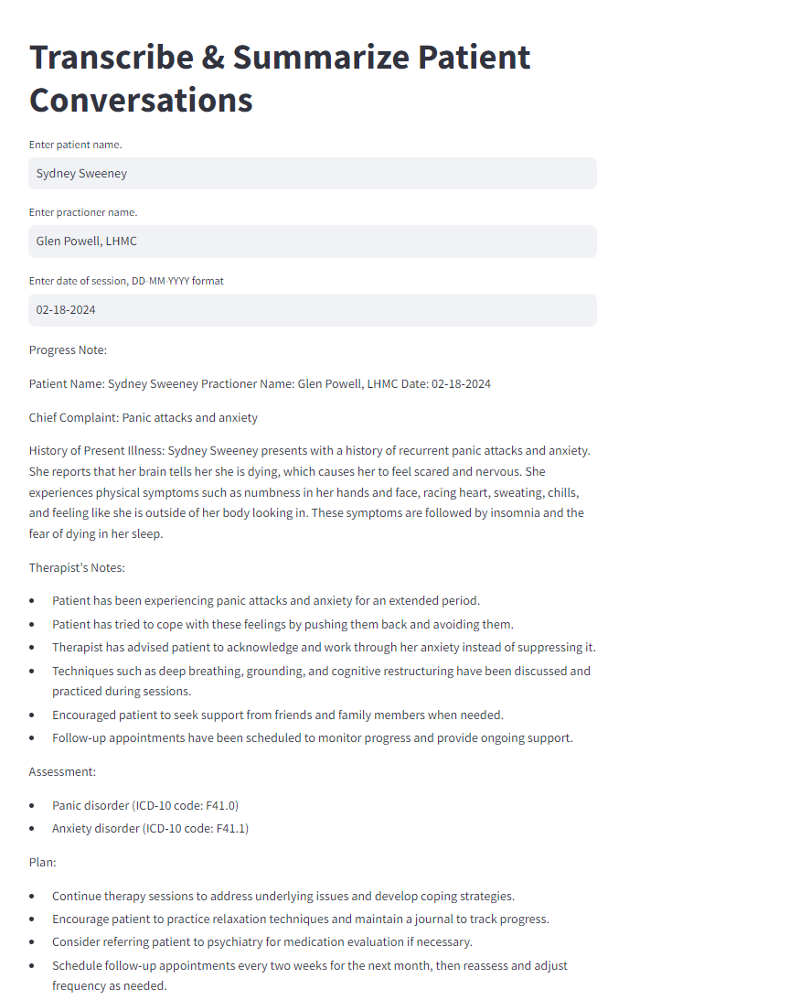
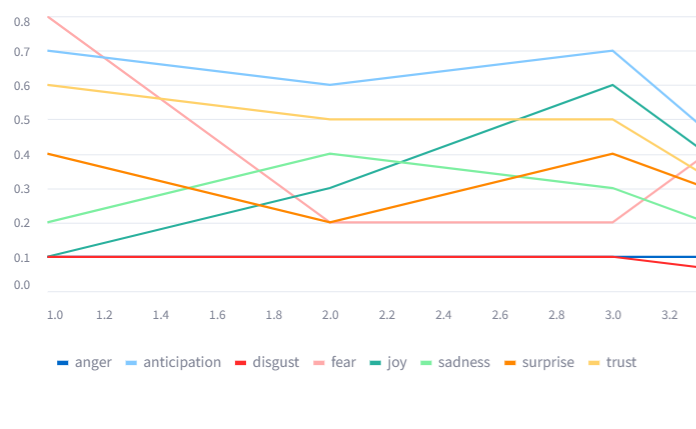
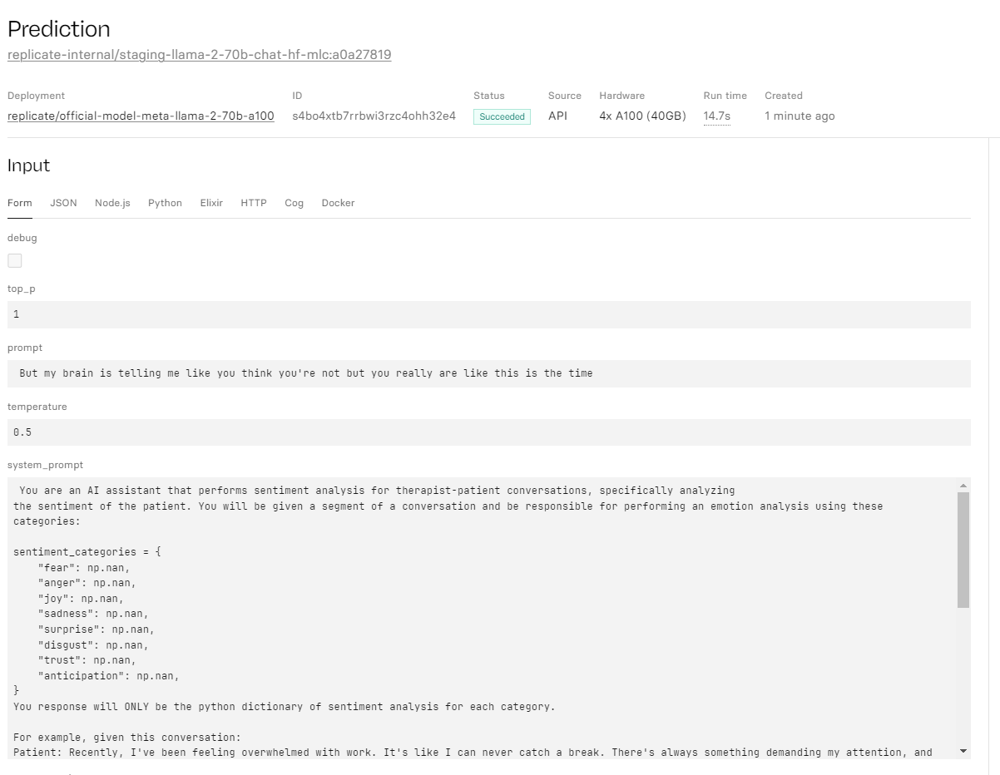

# Sante - Transcription of Conversations and Generation of Progress Notes for Mental Health Professionals

*Sante* is an AI-powered transcription, note taking, and analytical assistant for licensed mental health practioners (talk therapists, psychiatrists, etc). 

It transcribes patient-provider/physician conversations using [OpenAI's Whisper](https://github.com/openai/whisper) and then lets the provider choose between progress notes, intake assessments, and assesment notes. Upon selection, the output of the transcription is forwarded to LLama-2-70B. This is done using [Replicate](https://replicate.com/meta/llama-2-70b-chat) (none of the inference is done locally), making this many times faster than inferencing locally. Afterwards, the transcription segments of the conversation are analyzed segment-by-segment with 8 emotion catgories in order to perform sentiment analysis. It utilizes [few-shot prompting](https://www.promptingguide.ai/techniques/fewshot) (system prompting with examples) and [Panda dataframes](https://pandas.pydata.org/) in order to accomplish this. 

Then, it plots the results in a stacked area chart.

Currently, it has a working MVP built with the very easy to work with [Streamlit](https://streamlit.io/cloud). 

Here's an example of what a stacked line chart that plots the patient's emotion categories during the session looks like:

The chart clearly needs a lot of work. 

Here's a look at the zero-shot prompt and an example of what prompts look like after being successfully transcribed by faster-whisper.

Here's a look at the few shot prompt that is used to get Llama-70b to perform sentiment  analysis on each emotion category:

The idea is a Pandas dataframe is looped through, each row corresponding to one segment in the transcription predicted by `faster-whisper`. A call to Replicate is made for each segment, generating a Python dict which is then used to populate the dataframe's values. It is then plotted.

Here's what an example of one the calls to replicate from a row in the dataframe looks like inside the Replicate dashboard:

Instructions 

1. Clone this repo, and run `pip install requirements.txt`. That'll get streamlit, pytorch, faster-whisper, ffmpeg, replicate, torchaudio, and numpy installed. 
2. When setting up whisper, make sure you pick the **right model size and compute**. `whisper-large` is very accurate. I used CPU / int8, and it was painfully slow.
    - Note that using `whisper-tiny` on CPU (quantized, no CUDA) **tends to yield gibberish** on anything that isn't high fidelity audio with American accents. `whisper-medium` or some other distilled large model gets the job reliably done for non-American accents
    - Ideally use CUDA, not CPU for this. Download cublass and [cudann](https://developer.nvidia.com/cudnn) to get that working.
3. Get an API token from Replicate since you'll need to utilize LLama-2-70b (or any LLM available)
    - Note that if you're not using a model, you will get a coldstart everytime. Some models might have a higher rate of coldstarts. 
4. Set up billing with Replicate (an entire 1 million for 10 cents, which is *nuts*).
5. Have an audio file ready. You can use `ffmpeg` to cut down clips to test things fast since longer clips = longer transcription time. 
6. Run the service with `streamlit run app.py` (and enable 'Always rerun in the top right' to enable a debug-like mode). Click **Upload Audio** in the left and select a file.
7. Click **Transcribe Audio** and wait. 
    - There's a lot of useful logging information in the console because I print every segment transcribed as the model is running as well as the dicts returned for the sentiment analysis.

## To Dos

* Implement long-term memory by using ChromaDB. Currently treatment_plan_updates and assessment_notes are yet to be implemented, since we need look at previous notes. We can't do any of that if the model doesn't have any embeddings/documents to gain long-term memory.
* Sentiment analysis of conversation, will try to do by end of weekend 3/3/2024.
    - Half implemented. Created data frame and populated with `segment.text`, `segment.start`, `segment.end`. Populated sentiment categories in df. Implemented 3/3/2024. ~~Need to now implement chunk-based iteration.~~ did not end up doing this, definitely needs to be implemented
    - **Done**. Sentiment categories are now populated with Replicate calls. Used `json.dumps()` to convert string response of Llama70b to dict. Area chart now works. 
    - Need to switch to pyplot for line graph, apparently st graphs are simple wrappers around some other graphQL client thingy 
* ~~ PDF support, also will need to try to finish by end of weekend 3/3/2024. Need to learn base64 encoding stuff.~~ Not a priority.

## Python Notes 
Variables inside try blocks in Python are accessible outside the block... meaning if the try block executes, you can access them later. Neat. 
`logging` is useful for logging stuff and especially for working with `try`-`except` blocks